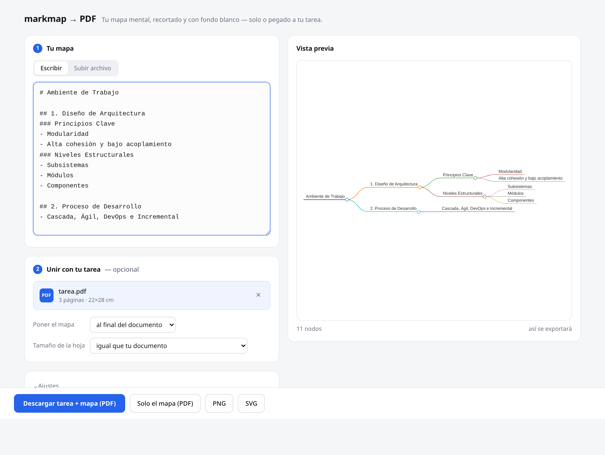

# markmap2pdf

Convierte tus mapas de [markmap](https://markmap.js.org/repl) a **PDF de una sola página, fondo blanco, recortado exacto y sin la marquita de agua** — y, si quieres, los pega directo dentro del PDF de tu tarea.

Ya no necesitas: captura de pantalla, Sejda, ni recortar a mano.



---

## Instalación (una sola vez)

```bash
git clone https://github.com/AmiyaMihari/Markmap-to-PDF.git
cd Markmap-to-PDF
bash setup.sh
```

`setup.sh` crea el entorno virtual en `.venv/`, instala `requirements.txt` y descarga
el Chromium que usa Playwright (~115 MB). Es idempotente: si algo se rompe, vuelve a correrlo.

---

## Uso: la interfaz web

```bash
bash start.sh
```

Se abre solo en <http://127.0.0.1:8765>. Desde ahí:

* **Escribe tu markdown** y ve el mapa en vivo mientras escribes (o arrastra un `.md`
  o el `.html` que descargas del REPL).
* **Arrastra el PDF de tu tarea** y elige dónde va el mapa: al final, al inicio o
  después de la página que digas.
* Descarga **el PDF unido**, o solo el mapa en **PDF / PNG / SVG**.

Puedes soltar los archivos en cualquier parte de la ventana: el `.pdf` se toma como
tu documento y el `.md` / `.html` como el mapa.

**Nada se guarda en disco.** Todo pasa en memoria y solo baja el archivo final,
así que no se te acumulan archivos sueltos en la carpeta.

En VS Code: `Ctrl+Shift+B` → "Abrir la interfaz web".

### Tamaño de la hoja al unir

| opción | qué hace |
|---|---|
| **igual que tu documento** (default) | la hoja del mapa queda idéntica a las de tu tarea (mismo tamaño y orientación) |
| **horizontal** | gira esa hoja a apaisado para que el mapa salga más grande |
| **del tamaño exacto del mapa** | la hoja mide justo lo que mide el mapa |

---

## Uso: línea de comandos

Sigue disponible si lo prefieres, o para procesar varios mapas de golpe:

```bash
python markmap2pdf.py mapa.md
python markmap2pdf.py ~/Downloads/markmap.html
python markmap2pdf.py mapas/*.md          # en lote
```

Genera `mapa.pdf`, `mapa.png` y `mapa.svg` junto al archivo de entrada.
Pruébalo con el mapa incluido: `python markmap2pdf.py ejemplo.md`

| flag | qué hace |
|---|---|
| `--out carpeta` | carpeta de salida |
| `--pad 40` | margen blanco alrededor, en px (default 20) |
| `--scale 4` | resolución del PNG (3 ≈ 288 dpi, default) |
| `--no-png` / `--no-svg` / `--no-pdf` | omitir formatos |

---

## El entorno se enciende solo

**En VS Code no tienes que activar nada.** `.vscode/settings.json` deja configurado:

* `python.defaultInterpreterPath` → `.venv/bin/python`
* `python.terminal.activateEnvironment` → `true`
* la terminal integrada del proyecto usa **bash**

Al abrir la carpeta, cada terminal nueva ya trae el `.venv` activado (verás `(.venv)`).
Requiere la extensión **ms-python.python**, ya recomendada en `.vscode/extensions.json`.

**Fuera de VS Code**, en bash:

```bash
source .venv/bin/activate      # a mano
# ...o sin activar nada:
.venv/bin/python markmap2pdf.py mapa.md
```

<details>
<summary>Opcional: que bash active el venv solo al entrar a la carpeta</summary>

Pega esto **una vez** al final de tu `~/.bashrc`:

```bash
# auto-activar .venv al entrar a una carpeta que lo tenga
_auto_venv() {
  if [[ -n "$VIRTUAL_ENV" && "$PWD" != "$(dirname "$VIRTUAL_ENV")"* ]]; then
    deactivate 2>/dev/null
  fi
  if [[ -z "$VIRTUAL_ENV" ]]; then
    local d="$PWD"
    while [[ "$d" != "/" ]]; do
      if [[ -f "$d/.venv/bin/activate" ]]; then
        source "$d/.venv/bin/activate"
        break
      fi
      d="$(dirname "$d")"
    done
  fi
}
PROMPT_COMMAND="_auto_venv${PROMPT_COMMAND:+; $PROMPT_COMMAND}"
```

Luego `source ~/.bashrc`.
</details>

---

## Cómo funciona el recorte

Dentro de un Chromium headless, el script:

1. elimina `.mm-toolbar` (la marquita de agua) y cualquier UI,
2. borra el `transform` de zoom que d3 aplica al `<g>`,
3. calcula el `getBBox()` real del contenido y reescribe el `viewBox` con ese tamaño + margen,
4. imprime a PDF con `@page size` idéntico al contenido → **una página, cero márgenes que recortar**.

El PDF sale vectorial: el texto se puede seleccionar y no pixelea al hacer zoom.
Al unirlo con tu tarea, el mapa se escala y centra en la hoja **sin perder calidad**
(sigue siendo vectorial, no se convierte a imagen).

---

## Bonus para Word

Word 2016+ inserta **SVG nativo** (`Insertar > Imágenes > Este dispositivo > mapa.svg`).
Se ve perfecto a cualquier tamaño y pesa nada. Si tu Word lo soporta, usa el `.svg`;
si no, el `.png` a 3× es la siguiente mejor opción. El PDF unido conviene cuando
entregas la tarea ya en PDF.

---

## Estructura

| archivo | qué es |
|---|---|
| `markmap2pdf.py` | el motor (renderizar + recortar) y el CLI |
| `app.py` | servidor de la interfaz web (FastAPI) |
| `static/index.html` | la interfaz |
| `setup.sh` / `start.sh` | instalar / arrancar |
| `ejemplo.md` | mapa de prueba |

---

## Google Colab

Solo si necesitas correrlo en otra máquina. La instalación de Chromium (~1–2 min)
se repite **cada sesión** y la interfaz web no aplica ahí; usa el CLI.

```python
!pip -q install playwright
!playwright install --with-deps chromium
!git clone -q https://github.com/AmiyaMihari/Markmap-to-PDF.git
%cd Markmap-to-PDF
```

```python
from google.colab import files
files.upload()          # sube tu mapa.md
!python markmap2pdf.py mapa.md
files.download('mapa.pdf')
```

---

## Si algo falla

* **El mapa sale vacío** → suele ser el CDN de markmap. Descarga el HTML del REPL
  y súbelo, que ese no depende del CDN.
  (Nota: el build de navegador correcto es `dist/browser/index.iife.js`;
  `dist/browser/index.js` es ESM y no define ningún global.)
* **Se ve cortado un nodo** → sube el margen en *Ajustes* (o `--pad 60` en el CLI).
* **Fondo gris u oscuro** → se fuerza `color_scheme="light"`; si tu HTML trae tema
  oscuro embebido, expórtalo del REPL con el tema claro (el solecito ☀).
* **`Address already in use`** → ya hay una instancia abierta, o usa otro puerto:
  `bash start.sh 9000`.
* **`playwright: command not found`** → no estás en el venv: `bash setup.sh`.

---

## Requisitos

Python 3.9+ (probado en 3.14). Todo lo demás lo instala `setup.sh`.
