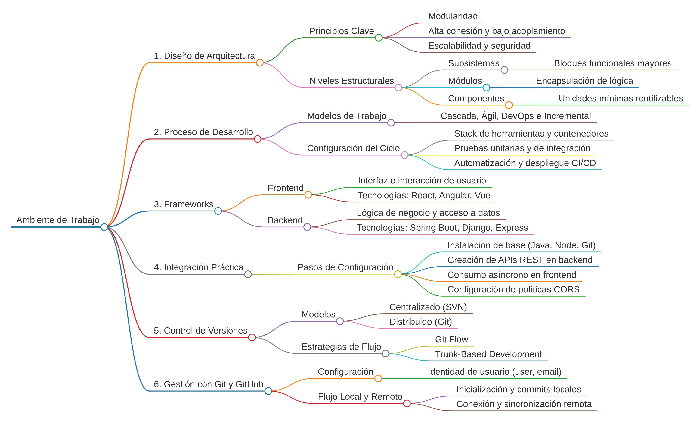

# markmap2pdf

Convierte tus mapas de [markmap](https://markmap.js.org/repl) a **PDF de una sola página, fondo blanco, recortado exacto y sin la marquita de agua** — listo para arrastrar a Word. También genera PNG (alta resolución) y SVG limpio.

Ya no necesitas: captura de pantalla, Sejda, ni recortar a mano.



---

## Instalación (una sola vez)

```bash
git clone https://github.com/AmiyaMihari/Markmap-to-PDF.git
cd Markmap-to-PDF
bash setup.sh
```

`setup.sh` crea el entorno virtual en `.venv/`, instala `requirements.txt` y descarga
el Chromium que usa Playwright (~115 MB). Es idempotente: si algo se rompe, vuelve a correrlo.

### El entorno se enciende solo

**En VS Code no tienes que activar nada.** `.vscode/settings.json` deja configurado:

* `python.defaultInterpreterPath` → `.venv/bin/python`
* `python.terminal.activateEnvironment` → `true`
* la terminal integrada del proyecto usa **bash**

Así que al abrir la carpeta, cada terminal nueva ya trae el `.venv` activado
(verás el prefijo `(.venv)`). Requiere la extensión **ms-python.python**, que ya
viene recomendada en `.vscode/extensions.json`.

**Fuera de VS Code**, en una terminal bash normal:

```bash
source .venv/bin/activate      # a mano
# ...o sin activar nada:
.venv/bin/python markmap2pdf.py mapa.md
```

<details>
<summary>Opcional: que bash active el venv solo al entrar a la carpeta</summary>

Pega esto **una vez** al final de tu `~/.bashrc`. Activa cualquier `.venv/`
al hacer `cd` a un proyecto que lo tenga, y lo desactiva al salir:

```bash
# auto-activar .venv al entrar a una carpeta que lo tenga
_auto_venv() {
  if [[ -n "$VIRTUAL_ENV" && "$PWD" != "$(dirname "$VIRTUAL_ENV")"* ]]; then
    deactivate 2>/dev/null
  fi
  if [[ -z "$VIRTUAL_ENV" ]]; then
    local d="$PWD"
    while [[ "$d" != "/" ]]; do
      if [[ -f "$d/.venv/bin/activate" ]]; then
        source "$d/.venv/bin/activate"
        break
      fi
      d="$(dirname "$d")"
    done
  fi
}
PROMPT_COMMAND="_auto_venv${PROMPT_COMMAND:+; $PROMPT_COMMAND}"
```

Luego `source ~/.bashrc`.
</details>

---

## Uso

```bash
# desde tu Markdown (ni siquiera abres markmap.js.org)
python markmap2pdf.py mapa.md

# o desde el HTML que descargas del REPL ("Download as interactive HTML")
python markmap2pdf.py ~/Downloads/markmap.html
```

Genera `mapa.pdf`, `mapa.png` y `mapa.svg` junto al archivo de entrada.
Pruébalo ya con el mapa incluido: `python markmap2pdf.py ejemplo.md`

Opciones:

| flag | qué hace |
|---|---|
| `--out carpeta` | carpeta de salida |
| `--pad 40` | margen blanco alrededor, en px (default 20) |
| `--scale 4` | resolución del PNG (3 ≈ 288 dpi, default) |
| `--no-png` / `--no-svg` / `--no-pdf` | omitir formatos |
| varios archivos | `python markmap2pdf.py mapas/*.md` procesa en lote |

### Tareas de VS Code

`Ctrl+Shift+B` sobre el `.md` abierto corre la conversión completa.
Con `Ctrl+Shift+P → Tasks: Run Task` también tienes "solo PDF" y "Setup del entorno".

---

## Cómo funciona el recorte

Dentro del navegador headless, el script:

1. elimina `.mm-toolbar` (la marquita de agua) y cualquier UI,
2. borra el `transform` de zoom que d3 aplica al `<g>`,
3. calcula el `getBBox()` real del contenido y reescribe el `viewBox` con ese tamaño + margen,
4. imprime a PDF con `@page size` idéntico al contenido → **una página, cero márgenes que recortar**.

El PDF sale vectorial: el texto se puede seleccionar y no pixelea al hacer zoom.

---

## Bonus para Word

Word 2016+ inserta **SVG nativo** (`Insertar > Imágenes > Este dispositivo > mapa.svg`).
Se ve perfecto a cualquier tamaño y pesa nada. Si tu Word lo soporta, usa el `.svg` y
olvídate del PDF; si no, el `.png` a `--scale 3` es la siguiente mejor opción
(el PDF conviene cuando el mapa va como anexo aparte).

---

## Google Colab

Solo si necesitas correrlo en otra máquina. Ojo: la instalación de Chromium
(~1–2 min) se repite **cada sesión**.

```python
!pip -q install playwright
!playwright install --with-deps chromium
!git clone -q https://github.com/AmiyaMihari/Markmap-to-PDF.git
%cd Markmap-to-PDF
```

```python
from google.colab import files
files.upload()          # sube tu mapa.md (o markmap.html)
!python markmap2pdf.py mapa.md
files.download('mapa.pdf')
```

---

## Si algo falla

* **Modo `.md` falla / mapa vacío** → suele ser el CDN de markmap.
  Descarga el HTML del REPL y usa el modo HTML, que no depende del CDN.
  (Nota: el build de navegador correcto es `dist/browser/index.iife.js`;
  `dist/browser/index.js` es ESM y no define ningún global.)
* **Se ve cortado un nodo** → sube el margen: `--pad 60`.
* **Fondo gris u oscuro** → el script fuerza `color_scheme="light"`; si tu HTML trae
  tema oscuro embebido, exporta desde el REPL con el tema claro activado (el solecito ☀ arriba a la derecha).
* **`playwright: command not found`** → no estás en el venv. `source .venv/bin/activate` o corre `bash setup.sh`.

---

## Requisitos

Python 3.9+ (probado en 3.14) y Playwright. Todo lo demás lo instala `setup.sh`.
